# School_District_Analysis

## Overview
This school district analysis looks at reading and math scores for a district schools. It organizes it by grade, school type, budget, and size. In addition this analysis pulled out data from Thomas High School's 9th grade class and reevaluated again. The code for this analysis is located here: [PyCitySchools_Challenge_testing](PyCitySchools_Challenge_testing.ipynb)

## Results

* The district summary changed very little. The Average Math score dropped by 0.1, from 79.0 to 78.9, when the 9th grade students from Thomas High School were removed.
Original:
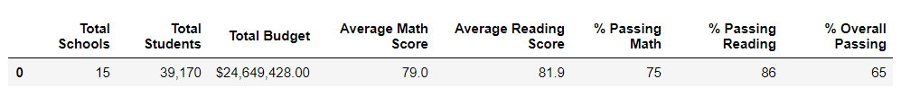

With Thomas High School removed:
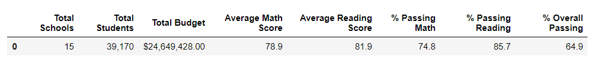

* The average reading and math scores, as well and the percent passing math and reading values changes slightly whent the 9th graders from Thomas High School were removed. Orinally, when the scores were changed to NaN, the averages changed slightly and the percentages dropped significantly. However, when the total student count was adjusted to remove the 9th graders from the count, the percent passing increased to similar to the original.
Original:
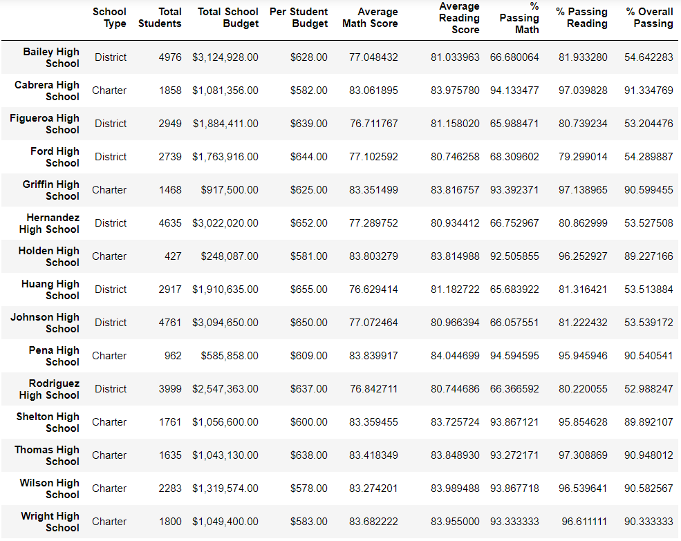
Replacing Scores with NaN:
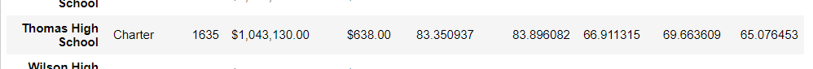
Adjusting Student Count:
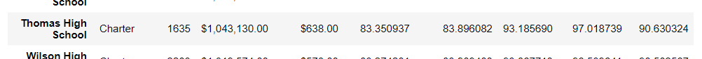

* Replacing the ninth graders math and reading scores did not affect Thomas High School performance relative to other schools. It remained at number 2 overall.
Original:
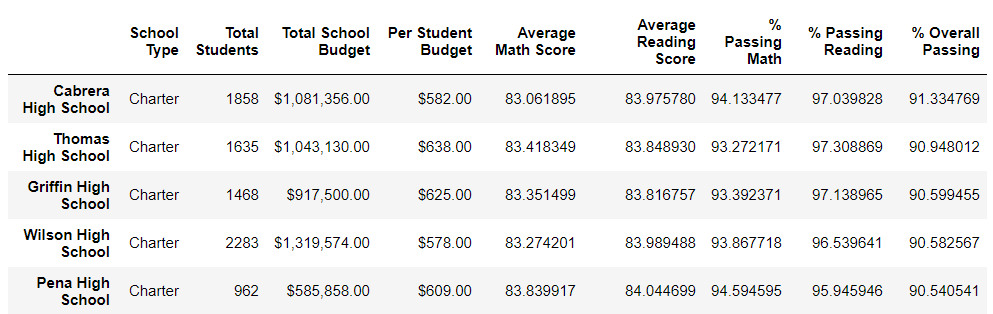
Updated:
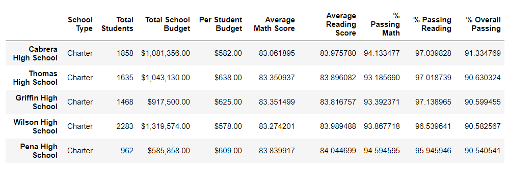

* Replacing the ninth-grade score affected the following:
    * In Math and reading scores by grade - the 9th grade average was NaN for math and reading. The math averages is shown below:
    
    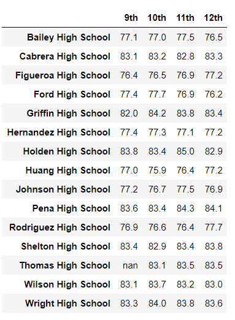
    * There was no change to scores by school spending
    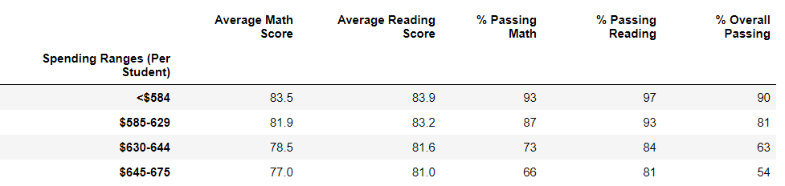
    * There was no change to scores by school size
    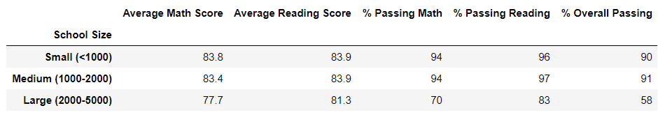
    * There was no change to scores by school type
    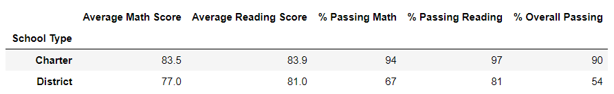
    
## Summary
Four changes in the updated school district analysis after reading and math scores at Thomas High School have been replaced with NaNs are as follows:

1. Math Average
2. Reading Average
3. Math Percent Passed
4. Reading Percent Passed
    
